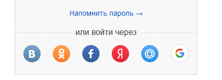
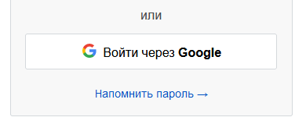

# 2 Socials Authentication

# Процесс аутентификации на сайте [https://esa.dvfu.ru/](https://esa.dvfu.ru/)

При первой загрузке сайта браузер посылает следующий запрос:

```css
GET http://esa.dvfu.ru/ HTTP/1.1
Host: esa.dvfu.ru
User-Agent: Mozilla/5.0 (Windows NT 10.0; Win64; x64; rv:92.0) Gecko/20100101 Firefox/92.0
Accept: text/html,application/xhtml+xml,application/xml;q=0.9,image/webp,*/*;q=0.8
Accept-Language: ru-RU,ru;q=0.8,en-US;q=0.5,en;q=0.3
Connection: keep-alive
Upgrade-Insecure-Requests: 1
```

Из-за того что клиент пытался подключиться по незащищенному соединению, сервер перенаправляет его на порт 443 предназначенный для https:

```css
HTTP/1.1 301 Moved Permanently
Date: Thu, 23 Sep 2021 06:18:34 GMT
Content-Type: text/html
Content-Length: 150
Connection: keep-alive
Location: https://esa.dvfu.ru:443/
```

Клиент заново посылает запрос, но уже по защищенному каналу.

```css
GET [https://esa.dvfu.ru/](https://esa.dvfu.ru/) HTTP/1.1
Host: [esa.dvfu.ru](http://esa.dvfu.ru/)
User-Agent: Mozilla/5.0 (Windows NT 10.0; Win64; x64; rv:92.0) Gecko/20100101 Firefox/92.0
Accept: text/html,application/xhtml+xml,application/xml;q=0.9,image/webp,*/*;q=0.8
Accept-Language: ru-RU,ru;q=0.8,en-US;q=0.5,en;q=0.3
Connection: keep-alive
Upgrade-Insecure-Requests: 1
Sec-Fetch-Dest: document
Sec-Fetch-Mode: navigate
Sec-Fetch-Site: none
Sec-Fetch-User: ?1
```

Сервер отвечает, и так как это первое соединение, заголовком Set-Cookie задает куки с именами: _csrf_univer и session-cookie.

```css
HTTP/1.1 200 OK
Content-Type: text/html; charset=UTF-8
Connection: keep-alive
Date: Thu, 23 Sep 2021 06:21:20 GMT
Set-Cookie: _csrf_univer=<...>; path=/; HttpOnly; SameSite=Lax; Secure
Strict-Transport-Security: max-age=15768000; includeSubDomains; preload;
X-XSS-Protection: 1; mode=block
X-Content-Type-Options: nosniff
X-Robots-Tag: none
X-Download-Options: noopen
X-Permitted-Cross-Domain-Policies: none
Set-Cookie: session-cookie=<...>; Max-Age=86400; Path=/; secure; HttpOnly
X-Frame-Options: SAMEORIGIN

<BODY>
```

Затем браузер отправляет запросы на загрузку таблиц стилей, скриптов (и целой кучи трекеров) с сайта добавляя в запрос установленные ранее куки.

Далее приведен пример запроса таблицы стилей:

```css
GET [https://esa.dvfu.ru/assets/48c3fa8a/css/style.css?v=1632371089](https://esa.dvfu.ru/assets/48c3fa8a/css/style.css?v=1632371089) HTTP/1.1
Host: [esa.dvfu.ru](http://esa.dvfu.ru/)
User-Agent: Mozilla/5.0 (Windows NT 10.0; Win64; x64; rv:92.0) Gecko/20100101 Firefox/92.0
Accept: text/css,*/*;q=0.1
Accept-Language: ru-RU,ru;q=0.8,en-US;q=0.5,en;q=0.3
Connection: keep-alive
Referer: [https://esa.dvfu.ru/](https://esa.dvfu.ru/)
Cookie: _csrf_univer=<...>; session-cookie=<...>
Sec-Fetch-Dest: style
Sec-Fetch-Mode: no-cors
Sec-Fetch-Site: same-origin
```

И ответа на него:

```css
HTTP/1.1 200 OK
Content-Type: text/css
Content-Length: 1711672
Connection: keep-alive
Date: Thu, 23 Sep 2021 06:21:57 GMT
Expires: Sat, 25 Sep 2021 06:21:57 GMT
Cache-Control: max-age=172800
Strict-Transport-Security: max-age=15768000; includeSubDomains; preload;
X-XSS-Protection: 1; mode=block
X-Content-Type-Options: nosniff
X-Robots-Tag: none
X-Download-Options: noopen
X-Permitted-Cross-Domain-Policies: none
Accept-Ranges: bytes
```

При каждом клике по странице скрипт на сайте посылает Ajax запрос: 

```css
POST https://esa.dvfu.ru/b6bbb55c9a85449c24c66c3d8ace099e HTTP/1.1
Host: esa.dvfu.ru
User-Agent: Mozilla/5.0 (Windows NT 10.0; Win64; x64; rv:92.0) Gecko/20100101 Firefox/92.0
Accept: */*
Accept-Language: ru-RU,ru;q=0.8,en-US;q=0.5,en;q=0.3
Content-Type: application/octet-stream
X-Requested-With: XMLHttpRequest
X-csrftoken: <...>
X-Ajax-Token: <...>
Content-Length: 748
Origin: https://esa.dvfu.ru
Connection: keep-alive
Referer: https://esa.dvfu.ru/
Cookie: _csrf_univer=<...>; session-cookie=<...>; _ym_uid=<...>; _ym_d=<...>; _ga=<...>; _gid=<...>; _ym_isad=<...>; _ym_visorc=<...>; csrf-token-name=csrftoken; csrf-token-value=<...>
Sec-Fetch-Dest: empty
Sec-Fetch-Mode: cors
Sec-Fetch-Site: same-origin

<BODY>
```

А сервер посылает ответ на него, в котором меняет csrf-token, используемый для защиты от межсайтового скриптинга, через куки.

```css
HTTP/1.1 200 OK
Content-Type: text/html; charset=utf-8
Connection: keep-alive
Date: Thu, 23 Sep 2021 06:36:35 GMT
Set-Cookie: csrf-token-name=csrftoken; Max-Age=600; Path=/; secure
Set-Cookie: csrf-token-value=<...>; Max-Age=600; Path=/; secure
X-Frame-Options: SAMEORIGIN
X-XSS-Protection: 1; mode=block
X-Content-Type-Options: nosniff
```

При отправке автиризационной формы и неверном пароле происходит следующий запрос:

```css
POST https://esa.dvfu.ru/ HTTP/1.1
Host: esa.dvfu.ru
User-Agent: Mozilla/5.0 (Windows NT 10.0; Win64; x64; rv:92.0) Gecko/20100101 Firefox/92.0
Accept: text/html,application/xhtml+xml,application/xml;q=0.9,image/webp,*/*;q=0.8
Accept-Language: ru-RU,ru;q=0.8,en-US;q=0.5,en;q=0.3
Content-Type: application/x-www-form-urlencoded
Content-Length: 289
Origin: https://esa.dvfu.ru
Connection: keep-alive
Referer: https://esa.dvfu.ru/
Cookie: _csrf_univer=<...>; session-cookie=<...>; _ym_uid=<...>; _ym_d=<...>; _ga=<...>; _gid=<...>; _ym_isad=<...>; _ym_visorc=<...>; csrf-token-name=<...>; csrf-token-value=<...>
Upgrade-Insecure-Requests: 1
Sec-Fetch-Dest: document
Sec-Fetch-Mode: navigate
Sec-Fetch-Site: same-origin
Sec-Fetch-User: ?1

_csrf_univer=<...>&bu=https://univer.dvfu.ru&username=<...>&password=<...>&rememberMe=1&csrftoken=<...>
```

Сервер возвращает страницу авторизации, на которой указывает, что пароль неверен.

```css
HTTP/1.1 200 OK
Content-Type: text/html; charset=UTF-8
Connection: keep-alive
Server: nginx/1.10.3
Date: Thu, 23 Sep 2021 06:41:30 GMT
Strict-Transport-Security: max-age=15768000; includeSubDomains; preload;
X-XSS-Protection: 1; mode=block
X-Content-Type-Options: nosniff
X-Robots-Tag: none
X-Download-Options: noopen
X-Permitted-Cross-Domain-Policies: none

<BODY>
```

При указании корректных данных клиент отправляет следующий запрос:

```css
POST https://esa.dvfu.ru/ HTTP/1.1
Host: esa.dvfu.ru
User-Agent: Mozilla/5.0 (Windows NT 10.0; Win64; x64; rv:92.0) Gecko/20100101 Firefox/92.0
Accept: text/html,application/xhtml+xml,application/xml;q=0.9,image/webp,*/*;q=0.8
Accept-Language: ru-RU,ru;q=0.8,en-US;q=0.5,en;q=0.3
Content-Type: application/x-www-form-urlencoded
Content-Length: 195
Origin: https://esa.dvfu.ru
Connection: keep-alive
Referer: https://esa.dvfu.ru/
Cookie: _csrf_univer=<...>; session-cookie=<...>; _ym_uid=<...>; _ym_d=<...>; _ga=<...>; _gid=<...>; _ym_isad=<...>; _ym_visorc=<...>; csrf-token-name=csrftoken; csrf-token-value=<...>
Upgrade-Insecure-Requests: 1
Sec-Fetch-Dest: document
Sec-Fetch-Mode: navigate
Sec-Fetch-Site: same-origin
Sec-Fetch-User: ?1

_csrf_univer=<...>&bu=https://univer.dvfu.ru&username=<...>&password=<...>&rememberMe=1
```

Сервер перенаправляет пользователя на страницу личного кабинета и устанавливает новые куки: 

```css
HTTP/1.1 302 Found
Content-Type: text/html; charset=UTF-8
Connection: keep-alive
Server: nginx/1.10.3
Date: Thu, 23 Sep 2021 06:47:28 GMT
Set-Cookie: _univer_session=<...>; path=/; domain=.dvfu.ru
Expires: Thu, 19 Nov 1981 08:52:00 GMT
Cache-Control: no-store, no-cache, must-revalidate
Pragma: no-cache
Set-Cookie: LtpaToken2=<...>==; path=/; domain=.dvfu.ru
Location: https://univer.dvfu.ru
Set-Cookie: _univer_identity=<...>; expires=Sat, 23-Oct-2021 06:47:28 GMT; Max-Age=2592000; path=/; domain=.dvfu.ru; HttpOnly; SameSite=Lax
Set-Cookie: _csrf_univer=<...>; path=/; HttpOnly; SameSite=Lax
Set-Cookie: _jwts=<...>; expires=Sat, 02-Oct-2021 12:37:53 GMT; Max-Age=798625; path=/; domain=.dvfu.ru; HttpOnly; SameSite=Lax
Strict-Transport-Security: max-age=15768000; includeSubDomains; preload;
X-XSS-Protection: 1; mode=block
X-Content-Type-Options: nosniff
X-Robots-Tag: none
X-Download-Options: noopen
X-Permitted-Cross-Domain-Policies: none
```

Клиент запрашивает страницу личного кабинета univer.dvfu.ru и указывает заданные куки:

```css
GET https://univer.dvfu.ru/ HTTP/1.1
Host: univer.dvfu.ru
User-Agent: Mozilla/5.0 (Windows NT 10.0; Win64; x64; rv:92.0) Gecko/20100101 Firefox/92.0
Accept: text/html,application/xhtml+xml,application/xml;q=0.9,image/webp,*/*;q=0.8
Accept-Language: ru-RU,ru;q=0.8,en-US;q=0.5,en;q=0.3
Referer: https://esa.dvfu.ru/
Connection: keep-alive
Cookie: _ym_uid=<...>; _ym_d=<...>; _ga=<...>; _gid=<...>; _ym_isad=<...>; _ym_visorc=<...>; _univer_session=<...>; LtpaToken2=<...>==; _univer_identity=<...>; _jwts=<...>
Upgrade-Insecure-Requests: 1
Sec-Fetch-Dest: document
Sec-Fetch-Mode: navigate
Sec-Fetch-Site: same-site
Sec-Fetch-User: ?1
```

Сервер предоставляет доступ к личному кабинету: 

```css
HTTP/1.1 200 OK
Content-Type: text/html; charset=UTF-8
Connection: keep-alive
Date: Thu, 23 Sep 2021 06:48:12 GMT
Expires: Thu, 19 Nov 1981 08:52:00 GMT
Cache-Control: no-store, no-cache, must-revalidate
Pragma: no-cache
Set-Cookie: _univer_identity=<...>; expires=Sat, 23-Oct-2021 06:48:12 GMT; Max-Age=2592000; path=/; domain=.dvfu.ru; HttpOnly; SameSite=Lax; Secure
Set-Cookie: _csrf_univer=<...>; path=/; HttpOnly; SameSite=Lax; Secure
Strict-Transport-Security: max-age=15768000; includeSubDomains; preload;
X-XSS-Protection: 1; mode=block
X-Content-Type-Options: nosniff
X-Robots-Tag: none
X-Download-Options: noopen
X-Permitted-Cross-Domain-Policies: none
Set-Cookie: session-cookie=<...>; Max-Age=86400; Path=/; secure; HttpOnly
X-Frame-Options: SAMEORIGIN

<BODY>
```

# Процесс аутентификации на сайте [www.drom.ru](http://www.drom.ru/)

Запрос главной страницы выглядит обычным образом:

```css
GET / HTTP/2
Host: www.drom.ru
User-Agent: Mozilla/5.0 (Windows NT 10.0; Win64; x64; rv:92.0) Gecko/20100101 Firefox/92.0
...
```

В ответ устанавливаются куки с именами ring, uid, veryFirstHit, cookie_cityid, cookie_regionid, my_geo:

```css
HTTP/2 200 OK
server: nginx
date: Thu, 23 Sep 2021 07:43:32 GMT
content-type: text/html; charset=windows-1251
set-cookie: ring=<...>; expires=Fri, 23-Sep-2022 07:43:31 GMT; Max-Age=31536000; path=/; domain=.drom.ru
set-cookie: uid=<...>; expires=Wed, 22-Sep-2021 07:43:31 GMT; Max-Age=0; path=/; domain=.drom.ru
set-cookie: veryFirstHit=<...>; expires=Thu, 23-Sep-2021 08:43:31 GMT; Max-Age=3600; path=/; domain=.drom.ru
set-cookie: cookie_cityid=<...>; expires=Wed, 05-Jul-2023 07:43:31 GMT; Max-Age=56160000; path=/; domain=.drom.ru
set-cookie: cookie_regionid=<...>; expires=Wed, 05-Jul-2023 07:43:31 GMT; Max-Age=56160000; path=/; domain=.drom.ru
set-cookie: my_geo=<...>; expires=Sun, 26-Sep-2021 07:43:31 GMT; Max-Age=259200; path=/; domain=.drom.ru
...

<BODY>
```

Для перехода на страницу авторизации выполняется ее запрос с указанием уже полученных кук:

```css
GET /sign?return=https://www.drom.ru/?tcb=1632383012 HTTP/2
Host: my.drom.ru
User-Agent: Mozilla/5.0 (Windows NT 10.0; Win64; x64; rv:92.0) Gecko/20100101 Firefox/92.0
Referer: https://www.drom.ru/
Connection: keep-alive
Cookie: ring=<...>; cookie_cityid=<...>; cookie_regionid=<...>; my_geo=<...>; dr_df=<...>; segSession=<...>; apple-pay-available=<...>; google-pay-available=<...>
...
```

В ответе устанавливаются куки signFrom:

```css
HTTP/2 200 OK
server: nginx
date: Thu, 23 Sep 2021 07:50:03 GMT
content-type: text/html; charset=windows-1251
set-cookie: signFrom=drom; path=/; domain=.drom.ru
...

<BODY>
```

При вводе логина скрипт на сайте отправляет Ajax запрос с указанием введенного имени пользователя.

```css
GET /sign/recover/helper?ajax=1&text=<...>&mode=sign&return=https://www.drom.ru/?tcb=1632383012&referer=https:// HTTP/2
Host: my.drom.ru
User-Agent: Mozilla/5.0 (Windows NT 10.0; Win64; x64; rv:92.0) Gecko/20100101 Firefox/92.0
X-Requested-With: XMLHttpRequest
Connection: keep-alive
Referer: https://my.drom.ru/sign?return=https://www.drom.ru/?tcb=1632383012
Cookie: ring=<...>; cookie_cityid=<...>; cookie_regionid=<...>; my_geo=<...>; dr_df=<...>; segSession=<...>; apple-pay-available=<...>; google-pay-available=<...>; signFrom=drom; _ga=<...>; _gid=<...>
...
```

В ответе браузер получает html текст для замены входа через все соцсети на вход через конкретную для пользователя соцсеть:

```css
HTTP/2 200 OK
server: nginx
date: Thu, 23 Sep 2021 07:52:42 GMT
content-type: text/html; charset=windows-1251
...

<BODY>
```

Было:



Стало:



При отправке формы происходит POST запрос с указанием кук, логина и пароля:

```css
POST /sign?return=https://www.drom.ru/?tcb=1632383012&login_by_password=1 HTTP/2
Host: my.drom.ru
User-Agent: Mozilla/5.0 (Windows NT 10.0; Win64; x64; rv:92.0) Gecko/20100101 Firefox/92.0
Content-Type: application/x-www-form-urlencoded
Origin: https://my.drom.ru
Connection: keep-alive
Referer: https://my.drom.ru/sign?return=https://www.drom.ru/?tcb=1632383012
Cookie: ring=<...>; cookie_cityid=<...>; cookie_regionid=<...>; my_geo=<...>; dr_df=<...>; segSession=<...>; apple-pay-available=<...>; google-pay-available=<...>; signFrom=drom; _ga=<...>; _gid=<...>
...

csrfToken=<...>&radio=sign&sign=<...>&password=<...>
```

Сервер перенаправляет клиент на адрес [https://www.drom.ru/checkAuthority?return=https://www.drom.ru/?tcb=1632383012](https://www.drom.ru/checkAuthority?return=https://www.drom.ru/?tcb=1632383012) и просит его использовать метод GET, а также устанавливает новую порцию кук с именами: boobs, logged_out, logged_in, pony, login:

```css
HTTP/2 303 See Other
server: nginx
date: Thu, 23 Sep 2021 07:55:55 GMT
content-type: text/html; charset=windows-1251
set-cookie: boobs=<...>; expires=Fri, 21-Jan-2022 07:55:55 GMT; Max-Age=10368000; path=/; domain=.drom.ru; HttpOnly
set-cookie: logged_out=deleted; expires=Thu, 01-Jan-1970 00:00:01 GMT; Max-Age=0; path=/; domain=.drom.ru
set-cookie: logged_in=<...>; expires=Sat, 23-Oct-2021 07:55:55 GMT; Max-Age=2592000; path=/; domain=.drom.ru
set-cookie: pony=<...>; expires=Fri, 21-Jan-2022 07:55:55 GMT; Max-Age=10368000; path=/; domain=.drom.ru; HttpOnly
set-cookie: login=<...>; expires=Fri, 23-Sep-2022 07:55:55 GMT; Max-Age=31536000; path=/; domain=.drom.ru
location: /checkAuthority?return=https://www.drom.ru/?tcb=1632383012
```

Клиент запрашивает указанный сервером адрес:

```css
GET /checkAuthority?return=https://www.drom.ru/?tcb=1632383012 HTTP/2
Host: my.drom.ru
User-Agent: Mozilla/5.0 (Windows NT 10.0; Win64; x64; rv:92.0) Gecko/20100101 Firefox/92.0
Referer: https://my.drom.ru/sign?return=https://www.drom.ru/?tcb=1632383012
Connection: keep-alive
Cookie: ring=<...>; cookie_cityid=<...>; cookie_regionid=<...>; my_geo=<...>; dr_df=<...>; segSession=<...>; apple-pay-available=<...>; google-pay-available=<...>; signFrom=drom; _ga=<...>; _gid=<...>; boobs=<...>; logged_in=<...>; pony=<...>; login=<...>
```

Сервер сообщает, что нужная страница доступна по адресу [https://www.drom.ru/?tcb=1632383012](https://www.drom.ru/?tcb=1632383012), а так же изменяет куки boobs, pony, uid и удаляет auth_need_interaction путем замены значения на deleted:

```css
HTTP/2 302 Found
server: nginx
date: Thu, 23 Sep 2021 07:55:55 GMT
content-type: text/html; charset=windows-1251
location: https://www.drom.ru/?tcb=1632383012
set-cookie: boobs=<...>; expires=Fri, 21-Jan-2022 07:55:55 GMT; Max-Age=10368000; path=/; domain=.drom.ru; HttpOnly
set-cookie: pony=<...>; expires=Fri, 21-Jan-2022 07:55:55 GMT; Max-Age=10368000; path=/; domain=.drom.ru; HttpOnly
set-cookie: uid=<...>; expires=Fri, 23-Sep-2022 07:55:55 GMT; Max-Age=31536000; path=/; domain=.drom.ru
set-cookie: auth_need_interaction=deleted; expires=Thu, 01-Jan-1970 00:00:01 GMT; Max-Age=0; path=/; domain=.drom.ru
...
```

Клиент посылает запрос с указанием кук на заданый сервером адрес:

```scss
GET /?tcb=1632383012 HTTP/2
Host: www.drom.ru
User-Agent: Mozilla/5.0 (Windows NT 10.0; Win64; x64; rv:92.0) Gecko/20100101 Firefox/92.0
Referer: https://my.drom.ru/
Connection: keep-alive
Cookie: ring=<...>; cookie_cityid=<...>; cookie_regionid=<...>; my_geo=<...>; dr_df=<...>; segSession=<...>; apple-pay-available=<...>; google-pay-available=<...>; signFrom=drom; _ga=<...>; _gid=<...>; boobs=<...>; logged_in=<...>; pony=<...>; login=<...>; uid=<...>
...
```

Сервер передает запрашиваемую страницу, а так же устанавливает куки la и удаляет logged_in и logged_out:

```css
HTTP/2 200 OK
server: nginx
date: Thu, 23 Sep 2021 07:55:56 GMT
content-type: text/html; charset=windows-1251
set-cookie: logged_in=deleted; expires=Thu, 01-Jan-1970 00:00:01 GMT; Max-Age=0; path=/; domain=.drom.ru
set-cookie: logged_out=deleted; expires=Thu, 01-Jan-1970 00:00:01 GMT; Max-Age=0; path=/; domain=.drom.ru
set-cookie: la=<...>; expires=Thu, 08-Jun-2073 15:51:50 GMT; Max-Age=1631778955; path=/; domain=.drom.ru
pragma: 
last-modified: Thu, 23 Sep 2021 07:55:55 GMT
...
```